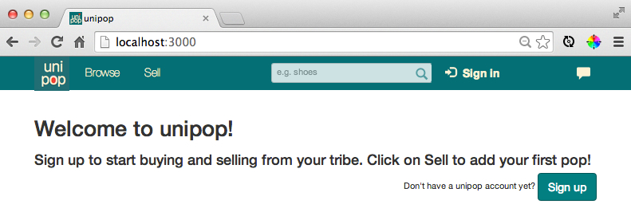

<!-- hey guys! I'm working on this slowly each day, and please contribute to your liking -->
<!--- Got Steve, Muhanad, Emma and Stef's blurb --->
<!-- Shelley and Ollie blurb still needed -->
[unipop]
====
**Connecting student buyers and sellers quickly, efficiently, and beautifully.**

Created as our Final Project at [Makers Academy], London.


<!-- Commented out because thought there were too many images-Lou  -->


  Unipop is a website and mobile app that enables students to buy and sell things speedily. Unipop only connects you to students within your university.

  Unipop is optimized for iPhone 5 and supports other mobile devices.

Table of Contents
===

* [How to use unipop]
* [Key features]
* [Design principles]
* [Technologies used]
* [Unipop for Coders]
* [Learning objectives]
* [Meet the team!]

Try unipop
===

Get started with unipop [here]. You will need to sign up in order to access the full range of unipop's features. For now, you may sign in with any email, as long as it contains a '@' sign.

Key Features
===
There are several core features that make up the backbone of unipop. A lot of time was spent debating over the details of each feature, because each detail had implications on the rest of the unipop. 

Homepage
---
The homepage is where all the images of stuff to sell are displayed. All images are contained within a beautiful, infinitely scrolling grid.

From here, the user can easily click on things to navigate anywhere.

University verification
---
Nowadays, each university assigns a unique email address to its students. For example, New York University (NYU) will assign an alpha numeric email address like 'jk2662@nyu.edu' to each student.

Unipop requires each student to have a valid university email address in order to sign up. Once signed up successfully, the user will automatically see all items sold by users that have the same email address. 

E.g. People with an '@nyu.edu' address will see all posts by '@nyu.edu' users. They won't see posts by other universities, like'@harvard.edu' or '@lse.ac.uk'.

A future consideration is to customize access to suit each university, as some universities are smaller and lack critical mass for unipop to be successful.

Item display page
---
<!-- getagging here. Stef, Steve? -->
When a user clicks on an item to see more information, they will be taken to the item's display page. 
They will see:
* who is selling the item
* its price
* the distance from the user to the item 
* auto-changing extra images
* an option to view its location on Google Maps
* an I want it button

I want it button
---
The I want it button adjusts its functionality to suit different conditions:

**I want it**

Let's say you wanted to buy a toaster. You browse on the homepage and find a nice shiny image of a toaster and decide you want it, so you click the I want it button.

If you are the first buyer, you will be taken to a brand new chatroom, and you start talking to the seller about his/her toaster.

If you are NOT the first buyer, you will be placed on the waitlist for this particularly popular toaster.

**I changed my mind**

Let's say you changed your mind about the toaster you just wanted. There will always be a I changed my mind button present that rescinds your want.

Don't worry if you accidentaly clicked it; unipop will flash an alert for double-confirmation.

Chatroom
---
Connecting buyers and sellers is what unipop is all about.

Each item only ever has one active chatroom, because the seller only chats to the first buyer in the waitlist. It's much like a marketplace, where the vendor only talks to the the first customer in the queue.

The chatroom is made real-time using Websockets.

Queue management
---
<!-- hi guys what I mean by this is the end negotion buttons, next buyer etc. -->
Through the chatroom, the seller has control over his/her queue. 

The seller can choose to end the negotiation with the current buyer and move on to the next buyer. 

However, in the name of fairness, the seller cannot arbitrarily choose who he/she chats to. He/she can only see and chat to the first person in the queue, and not anyone behind. This is important because it guards unipop against becoming an unwieldy and ultimately inefficient auctioning site.

'Pops' page
---
"Pop something on unipop!"

Each item a user tries to sell is referred to as a 'pop'.

Your 'pops page' is similar to a profile page, where all the pops you're selling or wanting can be seen.

[Back to the top]

Design Principles
===
<!-- mobile first, responsive design, bootstrap elements, bootstrap buttons, grid/image-central view etc. Muhanad, Emma? -->
Mobile first was our motto for the design. The design is responsive and uses bootstrap elements. The overall theme is self-created.

[Back to the top]

Technologies Used
====

|Technology                 |Used for                        |
|---------------------------|--------------------------------|
|Ruby                       |Main programming language       |
|Javascript                 |Maps/Ajax & jQuery              |
|Ajax                       |Mainly used in the chatroom     |
|HTML5                      |Styling and using smartphone camera |
|jQuery                     |Manipulating the DOM for a dynamic experience |
|Ruby on Rails              |Model View Controller web application framework |
|[Heroku]                   |Deployment                      |
|heroku_secrets             |to push secrets to Heroku in Rails |
|New Relic                  |Real time application monitoring|
|Papertrail                 |Tracking events & Log management|
|Cucumber/Capybara          |Feature testing                 |
|Rspec                      |Unit testing                    |
|Factory Girl               |A library for setting up Ruby objects as test data  |
|Postgrsql                  |Database                        |
|Devise                     |Creating users                  |
|Amazon Web Services        |Bulk image hosting              |
|Paperclip                  |Uploading images                |
|Bootstrap                  |Base theme                      |
|will_paginate              |A pagination library that integrates with Ruby on Rails and Sinatra |
|CSS3                       |Styling                         |
|Websockets                 |Real-time updates in Chatroom   |
|Geolocation/Geomapper      |Calculating distance and showing maps  |

[Back to the top]

Unipop for Coders
===
Unipop can be run in your localhost if you wish to play around with the code. You can do so easily by following these steps.

First you'll need to clone this repo by typing this snippet into your terminal:
```
$ git clone git@github.com:StephanMusgrave/unipop.git
```

Then change into the newly cloned directory:
```
$ cd unipop
```

Acquire the necessary gems to run unipop:
```
$ bundle install
```

Update your database by running the migration:
```
$ bin/rake db:migrate
```

Run the application on your localhost (defaults to port 3000):
```
$ bin/rails server
```

Finally, open up your web broswer, and in the URL field type:
``
localhost:3000
``

Now your browser should look something like this:


[Back to the top]

Learning Objectives
===
* Materializing a concept into a functional product
* Adding to and reinforcing our knowledge of Ruby and Rails
* Using testing to drive the direction of our product (specifically, behaviour driven test driven developement)
* Agile team management
* Pair programming

[Back to the top]

Meet the team!
===
 
 
 
 
 

 

**Thanks for reading!**

[Louise Lai] | [Muhanad Al-Rubaiee] | [Ollie Delevingne] | [Shelley Hope] | [Emma Williams] | [Stefania Cardenas] | [Steve Musgrave]

[Back to the top]

<!-- links, in order of appearance -->

[unipop]:http://unipop.herokuapp.com/

[How to use unipop]:https://github.com/StephanMusgrave/unipop#how-to-use-unipop
[Key features]:https://github.com/StephanMusgrave/unipop#key-features
[Design principles]:https://github.com/StephanMusgrave/unipop#design-principles
[Technologies used]:https://github.com/StephanMusgrave/unipop#technologies-used
[Unipop for Coders]: https://github.com/StephanMusgrave/unipop#unipop-for-coders
[Learning objectives]:https://github.com/StephanMusgrave/unipop#learning-objectives
[Meet the team!]: https://github.com/StephanMusgrave/unipop#meet-the-team

[here]:http://unipop.herokuapp.com/
[Heroku]:http://unipop.herokuapp.com/

[Louise Lai]:https://github.com/loulai
[Muhanad Al-Rubaiee]:https://github.com/muhanad40
[Ollie Delevingne]:https://github.com/odelevingne
[Shelley Hope]:https://github.com/ShelleyHope
[Emma Williams]:https://github.com/Em01
[Stefania Cardenas]:https://github.com/stefaniacardenas
[Steve Musgrave]:https://github.com/StephanMusgrave
[Makers Academy]:http://www.makersacademy.com

[Back to the top]:https://github.com/StephanMusgrave/unipop#table-of-contents